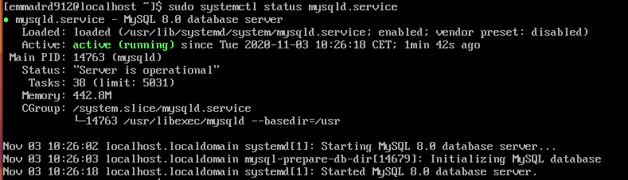

# TP4 : Utilisation avancé du filtrage de paquets réseaux
## Construction d’une DMZ complexe


# Sommaire

- [Serveur Web](##serveur-web)
    - [I. Installation de Apache](###i-installation-de-apache)
    - [II. Installation de Wordpress](###ii-installation-de-wordpress)
    - [III. Iptables](###iii-iptables)
- [Serveur Base de données](##Serveur-base-de-données)
    - [I. Installation du serveur MySQL](###i-installation-du-serveur-mysql)
    - [II. Création de la base de données Wordpress](###ii-création-de-la-base-de-données-wordpress)
    - [III. Nftables](###iii-nftables)
- [Firewall pfSense frontal](##Firewall-pfSense-frontal)
- [Démonstration](##Démonstration)

## Serveur Web 

OS : Centos 7 (Réseau Privé Hôte pour avoir l'IP fixe, qu'on reconfigure aussi dans ``/etc/sysconfig/network-scripts/ifcfg-enp0s8``)


###  I. Installation de Apache 

```
sudo yum install httpd
```

Ensuite on peut démarrer le serveur httpd :

```
sudo systemctl start httpd
sudo systemctl enable httpd
```
On peut vérifier son statut :


Le service est bien **démarré**. Il suffit de se rendre sur internet pour vérifier notre page en allant sur l'adresse IP de notre machine : http://192.168.33.2 


### II. Installation de Wordpress 

Pour l'installation de Wordpress, il faut avoir préalablement PHP d'installé avec une version **supérieure à 5.6** pour que ce soit fonctionnel.

- Téléchargement et installation de Wordpress :

```
cd ~
wget http://wordpress.org/latest.tar.gz
tar xzvf latest.tar.gz
sudo rsync -avP ~/wordpress/ /var/www/html/
mkdir /var/www/html/wp-content/uploads
sudo chown -R apache:apache /var/www/html/*
```

- Configuration de la base de donnée pour Wordpress :

```
cd /var/www/html    
cp wp-config-sample.php wp-config.php
vim wp-config.php
```

Fichier de configuration (à remplacer par les informations correspondantes):


Apache ne lit pas les fichiers PHP par défaut, donc dans le fichier (``vi /etc/httpd/conf/httpd.conf``), il faut ajouter à ``Directory index`` :

``index.php``

On redémarre le serveur ``httpd`` (``sudo service httpd restart``), et on remarque que le Wordpress est mis en place. 


### III. Iptables

#### Désactiver FirewallD

    sudo systemctl stop firewalld
    sudo systemctl disable firewalld
    sudo systemctl mask --now firewalld

#### Installation et Activation de Iptables

    sudo yum install iptables-services
    sudo systemctl start iptables
    sudo systemctl start ip6tables
    sudo systemctl enable iptables
    sudo systemctl enable ip6tables

#### Check du service & des règles appliquées

    sudo systemctl status iptables
    sudo iptables -nvL


#### Filtrage Iptables

On ajoute ces lignes dans le fichier ``/etc/sysconfig/iptables``


    # Generated by iptables-save v1.4.21 on Tue Nov 10 12:25:28 2020
    *filter
    :INPUT DROP [1:328]
    :FORWARD DROP [0:0]
    :OUTPUT DROP [0:0]

    # SSH pour moi
    -A INPUT -p tcp -m tcp --dport 22 -m conntrack --ctstate NEW,RELATED,ESTABLISHED -j ACCEPT
    -A OUTPUT -p tcp -m tcp --sport 22 -m conntrack --ctstate NEW,RELATED,ESTABLISHED -j ACCEPT

    # SSH
    -A INPUT -p tcp -m tcp -s 192.168.211.15 --dport 22 -m conntrack --ctstate NEW,RELATED,ESTABLISHED -j ACCEPT
    -A OUTPUT -p tcp -m tcp -s 192.168.211.15 --sport 22 -m conntrack --ctstate NEW,RELATED,ESTABLISHED -j ACCEPT

    # HTTP/HTTPS
    -A INPUT -p tcp -m tcp --dport 80 -j ACCEPT
    -A INPUT -p tcp -m tcp --dport 443 -j ACCEPT
    -A OUTPUT -p tcp -m tcp --sport 443 -j ACCEPT
    -A OUTPUT -p tcp -m tcp --sport 83 -j ACCEPT

    # DNS
    -A INPUT -p udp -m udp --dport 53 -m conntrack --ctstate NEW,RELATED,ESTABLISHED -j ACCEPT
    -A INPUT -p udp -m udp --sport 53 -m conntrack --ctstate NEW,RELATED,ESTABLISHED -j ACCEPT
    -A INPUT -p tcp -m tcp --dport 53 -m conntrack --ctstate NEW,RELATED,ESTABLISHED -j ACCEPT
    -A INPUT -p tcp -m tcp --dport 53 -m conntrack --ctstate NEW,RELATED,ESTABLISHED -j ACCEPT

    # Mysql
    -A INPUT -s 192.168.35.4/24 -p tcp -m tcp --sport 3306 -m conntrack --ctstate NEW,RELATED,ESTABLISHED -j ACCEPT
    -A OUTPUT -d 192.168.35.4/24 -p tcp -m tcp --dport 3306 -m conntrack --ctstate NEW,RELATED,ESTABLISHED -j ACCEPT

    # ICMP
    -A INPUT -p tcp -d 192.168.211.15  -m tcp --dport 80 -j ACCEPT
    -A OUTPUT -p tcp -s 192.168.211.15  -m tcp --dport 80 -j ACCEPT

    COMMIT
    # Completed on Tue Nov 10 12:25:28 2020
    # Generated by iptables-save v1.4.21 on Tue Nov 10 12:25:28 2020
    *nat
    :PREROUTING ACCEPT [1:328]
    :INPUT ACCEPT [0:0]
    :OUTPUT ACCEPT [0:0]
    :POSTROUTING ACCEPT [0:0]
    COMMIT
    # Completed on Tue Nov 10 12:25:28 2020
    # Generated by iptables-save v1.4.21 on Tue Nov 10 12:25:28 2020
    *mangle
    :PREROUTING ACCEPT [1:328]
    :INPUT ACCEPT [1:328]
    :FORWARD ACCEPT [0:0]
    :OUTPUT ACCEPT [0:0]
    :POSTROUTING ACCEPT [0:0]
    COMMIT
    # Completed on Tue Nov 10 12:25:28 2020


Sauvegarder puis

    sudo service iptables restart

Pour check

    sudo iptables -L

## Serveur base de données 

Le serveur de base de données devra être positionné sur un réseau dédié comme indiqué sur le schéma, et disposer d’une adresse IP fixe. Il fonctionnera sous **Centos 8**, et hébergera via un serveur **MySQL** la base de données du site Wordpress.

### I. Installation du serveur MySQL

```
sudo dnf install mysql-server
sudo systemctl start mysqld.service
sudo systemctl enable mysqld.service
```

On peut vérifier ensuite l'installation :




### II. Création de la base de données Wordpress 

```
CREATE DATABASE wordpress;
```

- Création d'un utilisateur ``admin`` et ajout de privilèges :

```
CREATE USER 'adminuser'@'localhost' IDENTIFIED BY 'toortoor';
GRANT ALL PRIVILEGES ON wordpress. * TO 'adminuser'@'localhost';
FLUSH PRIVILEGES;
```

- Ajoutez l'utilisateur avec l'adresse de ``remote`` :

```
CREATE USER 'adminuser'@'192.168.33.2' IDENTIFIED BY 'toortoor';
GRANT ALL PRIVILEGES ON wordpress. * TO 'adminuser'@'192.168.33.2';
FLUSH PRIVILEGES;
```

- Puis dans ``/etc/my.cnf``, on ajoute le ``bind adrress`` (l'ip de notre database):

```
bind-address=192.168.35.4
```

### III. Nftables

#### Désactivation de FirewallD

    sudo systemctl disable --now firewalld
    sudo systemctl mask firewalld
    reboot
    
#### Mise en place du Filtrage
    
On va dans ``/etc/sysconfig/nftables.conf`` et on met

    table inet filter {
            chain input {
                    type filter hook input priority 0;
                    iifname lo accept;
                    ip protocol icmp accept;
                    tcp dport 80 accept;
                    tcp dport 443 accept;
                    tcp dport 53 accept;
                    udp dport 53 accept;
                    tcp dport ssh ip saddr 192.168.211.15/24 accept;
                    tcp dport 3306 ip saddr 192.168.33.2/24 accept;
                    policy drop;
            }
            chain forward {
                    type filter hook forward priority 0;
                    policy drop;
            }
            chain output {
                    type filter hook output priority 0;
                    tcp sport 80 accpet;
                    tcp sport 443 accept;
                    tcp sport 53 accept;
                    udp sport 53 accept;
                    tcp sport 3306 ip daddr 192.168.33.2/24 accept;
                    tcp sport ssh ip daddr 192.168.33.2/24 accept;
                    policy drop;
            }
    }

On a plus qu'à :

    systemctl enable nftables.service
    reboot

## Firewall pfSense frontal

Installation classique de pfSense puis on configure sur le panel Web les interfaces du serveur BDD et Web.

Dans leurs IPs, on doit définir la Gateway pour les relier :


Les règles WAN :


Les règles Web :


Les règles BDD : 


## Démonstration

Le serveur Web peut se connecter à MySql sur le serveur base de données après la mise en place des règles de filtrage : 


